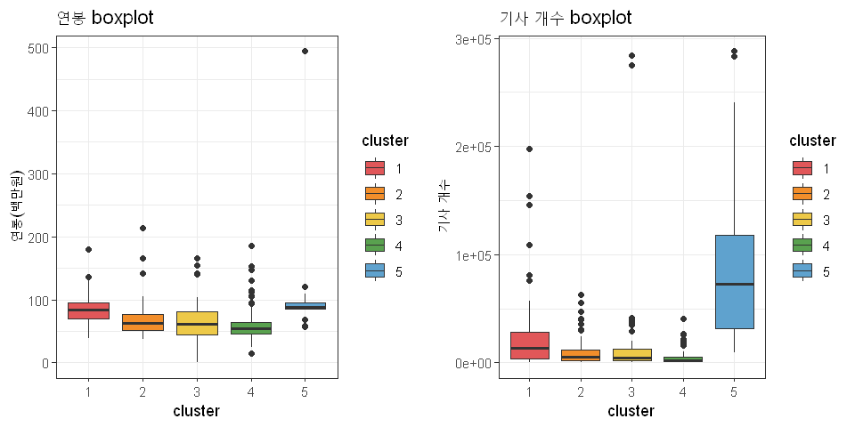

<h1> 구직자를 위한 기업 트렌드 시각화 경진대회 팀 케어베어</h1>

<hr />

<div>
한국 고용 정보원이 주체하는 "구직자를 위한 기업 트렌드 시각화 경진대회 장려상(4위) 수상작입니다.
</div>
<div>

<p>시각화 사이트 링크는 <a href="https://public.tableau.com/views/_16433263950510/sheet0?:language=ko-KR&:display_count=n&:origin=viz_share_link" style = "font-size: 30px; font-weight:500">Tableau</a> 입니다. 이 주소로 대시보드를 확인해보시면 됩니다. Tableau 사용법은 아래 Tableau 시각화 항목에 있으니 참고해 주시길 바랍니다.</p>
<div style = " margin-top:50px">
    
</div>
<div style = "margin-top: 50px; margin-bottom: 50px">
    
</div>
<h2>1. 서론</h2>
<br>
    <h3>1.1. 문제 제기</h3>
<div style = "margin-top: 30px;margin-bottom: 30px">  
    
</div>

<div style = "font-weight:500;margin-bottom:10px">
<p>취업 불황의 시대의 구직자를 위해, 저희는 두 가지의 문제에 맞춰 기업 트렌드 시각화를 진행하였습니다. 첫 번째 문제점은 기업에서 제공하는 정보가 불충분하며 찾기 어렵다는 점이고, 두 번째 문제점은 대다수의 구직자가 한 시즌에 여러 기업에 지원하지만 그 기업들의 정보를 한 번에 파악하여 비교하기는 어렵다는 점입니다. 이를 해결하기 위해 단일 기업의 정보 수집과 여러 기업의 비교를 동시에 가능하게 하는 시각화 대시보드를 제작하였습니다. 또한 기업 비교에 사용되는 여러 지표들을 변수로 사용하여 클러스터링을 진행하고 클러스터별 특징을 도출함으로써 기업의 트렌드를 쉽게 파악할 수 있도록 하였습니다. 저희가 제공하는 시각화 대시보드와 클러스터링 결과를 바탕으로 취업 준비 과정에서 필요한 기업 트렌드를 쉽게 얻을 수 있기를 바랍니다. 😊 </p>
<div>  
<div style = "margin-top: 50px">
    <h3>1.2. 데이터 소개</h3>
<p>저희가 제공하고자 한 기업 트렌드는 1) 기업 경쟁력 및 성장 가능성 2) 평균 연봉 3) 기업 인지도 4) 고용 안정성 5) 소재지 이렇게 다섯 가지입니다. 한국거래소에서 명시된 산업군과 주식시장 업종 분류(WICS)를 참고하여 소비재, 건강관리, 소재, 산업재, 전기전자, 유통업, 서비스업, 금융업, 소프트웨어, 기타 총 10개의 산업군으로 분류했으며, 각 산업군별 시가총액 상위 30개의 기업을 선택해 총 300개의 기업에 대해 분석을 진행하였습니다. </p>
    <p style ="margin-bottom : 10px">1) 기업 경쟁력 및 성장 가능성을 보여주기 위하여 2020년도 매출액과 2016년도부터 2020년도까지의 영업이익 데이터를 사용하였습니다. 위 데이터는 dart api를 통해 수집하였으며, api로 구할 수 없는 기업의 데이터는 dart에서 제공하는 사업보고서를 참고했습니다.</p>
    <p style ="margin-bottom : 10px">2) 연봉 데이터는 dart api를 통해 연간 급여 총액과 직원 수 합계를 추출한 후, 연간 급여 총액을 직원 수로 나눠 1인 평균 급여액을 계산하였습니다. api로 연간 급여 총액을 추출할 수 없는 기업은 사업보고서를 참고하여 직접 작성하였으며, 사업보고서상 연간 급여 총액 산정 기준과 1인 평균 급여액 산정 기준이 다른 기업은 사업보고서에 있는 1인 평균 급여액을 사용했습니다.</p>
    <p style ="margin-bottom : 10px">3) 기업 인지도를 보여주는 데이터로는 기업의 기사 노출 빈도를 사용했습니다. 조선일보, 중앙일보, 동아일보, MBC, SBS, KBS, 매일경제, 한국경제 총 8개의 언론사에서 2021년도에 작성한 기사의 개수를 네이버 뉴스 크롤링을 통해 구하였고, 이와 더불어 기사 제목 크롤링을 진행하여 각 기업을 설명하는 키워드를 추출하였습니다.</p>
    <p style ="margin-bottom : 10px">4) 고용 안정성을 보여주는 지표로는 dart api에서 제공하는 기간의 정함이 없는 근로자와 기간제 근로자의 수, 평균 근속연수를 사용하였습니다. api로 얻을 수 없는 정보는 dart에서 제공하는 사업보고서를 참고하였으며, 각 부서 직원의 평균 근속연수를 부서의 직원 수만큼 가중치를 주어 평균을 계산하였습니다.</p>
    <p style ="margin-bottom : 10px">5) 기업의 소재지는 dart api가 제공하는 주소를 추출한 후 행정동 주소는 도로명 주소로 직접 대체하였으며, 위치를 지도 위에 표시하기 위하여 GeocodingTool64 프로그램으로 위·경도를 구하였습니다.</p>
    
</div>
</div>


```R
options(warn=-1, message = -1)
library(tidyr)
library(dplyr)
library(reshape2)
library(fpc)
library(cluster)
library(Rtsne)
library(ggplot2)
library(factoextra)
library(purrr)
library(ggsignif)
library(gridExtra)
library("broom")

```

<div>
<h2 style = "margin-bottom: 10px">2. 본론</h2>
<h3>2.1. EDA</h3>
</div>


<p style = "font-weight:bolder">1) Data importing</p>


```R
company=read.csv('final기업정보ver4.csv')


```


<div style = "font-weight:bolder; margin-bottom:10px">2) Data manipulation</div>  
   
<li style = "font-weight:bolder">금액 단위 변경</li> 

매출액, 영업이익 단위: 1,000,000,000원(10억)

연봉 단위: 1,000,000원(100만원)


```R


company=as.data.frame(apply(company, 2, function(x) gsub(',','', x)))


company=as.data.frame(company %>% select(-c(산업군, 기업, 주소)) %>% apply(2, as.numeric)) %>% mutate(기업=company$기업, 산업군=company$산업군, 주소=company$주소) %>% .[, c(27, 28, 1:26, 29)]

company[, 3:8]=as.data.frame(company %>% select(c(매출20:이익16)) %>% apply(2, function(x) round(x/1000000000, 2)))

company[, c('남평균연봉', '여평균연봉', '평균연봉')]=as.data.frame(company %>% select(c(남평균연봉, 여평균연봉, 평균연봉)) %>%
                                                       apply(2, function(x) round(x/1000000, 2)))


```

<li style = "font-weight:bolder">NA 유무 column 생성</li>


```R

company=company %>% mutate(이익na=apply(is.na(company), 1, sum))
company[is.na(company)] <- 0


```

<li style = "font-weight:bolder">이익na, 산업군 factor화</li>


```R

company=company %>% mutate(산업군=as.factor(산업군), 이익na=as.factor(이익na))


```


<!-- <table>
<thead><tr><th scope=col>기업</th><th scope=col>산업군</th><th scope=col>매출20</th><th scope=col>이익20</th><th scope=col>이익19</th><th scope=col>이익18</th><th scope=col>이익17</th><th scope=col>이익16</th><th scope=col>남정직원수</th><th scope=col>남계약직수</th><th scope=col>...</th><th scope=col>직원수</th><th scope=col>평균근속연수</th><th scope=col>평균연봉</th><th scope=col>경도</th><th scope=col>위도</th><th scope=col>기사개수</th><th scope=col>전체순위</th><th scope=col>산업군순위</th><th scope=col>주소</th><th scope=col>이익na</th></tr></thead>
<tbody>
	<tr><td>삼성물산                                      </td><td>유통업                                        </td><td>30216.12                                      </td><td> 857.08                                       </td><td>866.77                                        </td><td>1103.89                                       </td><td>881.27                                        </td><td>139.52                                        </td><td>6160                                          </td><td>928                                           </td><td>...                                           </td><td> 8831                                         </td><td>12.15                                         </td><td>100.43                                        </td><td>127.1753                                      </td><td>37.54878                                      </td><td>33524                                         </td><td> 43                                           </td><td> 5                                            </td><td>서울특별시 강동구 상일로6길 26 -              </td><td>0                                             </td></tr>
	<tr><td>셀트리온헬스케어                              </td><td>유통업                                        </td><td> 1627.60                                      </td><td> 362.11                                       </td><td> 82.79                                        </td><td> -25.20                                       </td><td>153.65                                        </td><td>155.30                                        </td><td>  65                                          </td><td>  3                                           </td><td>...                                           </td><td>  135                                         </td><td> 3.78                                         </td><td>214.03                                        </td><td>126.6407                                      </td><td>37.37171                                      </td><td>21541                                         </td><td> 62                                           </td><td> 8                                            </td><td>인천광역시 연수구 아카데미로51번길 19 4층     </td><td>0                                             </td></tr>
	<tr><td>이마트                                        </td><td>유통업                                        </td><td>22033.01                                      </td><td> 237.15                                       </td><td>150.65                                        </td><td> 462.83                                       </td><td>584.89                                        </td><td>568.60                                        </td><td>9454                                          </td><td>  0                                           </td><td>...                                           </td><td>24889                                         </td><td> 9.89                                         </td><td> 39.11                                        </td><td>127.0533                                      </td><td>37.54004                                      </td><td>81196                                         </td><td> 16                                           </td><td> 2                                            </td><td>서울특별시 성동구  뚝섬로 377                 </td><td>0                                             </td></tr>
	<tr><td>GS리테일                                      </td><td>유통업                                        </td><td> 8862.32                                      </td><td> 252.57                                       </td><td>238.84                                        </td><td> 180.26                                       </td><td>165.71                                        </td><td>218.06                                        </td><td>3216                                          </td><td>174                                           </td><td>...                                           </td><td> 4407                                         </td><td> 7.01                                         </td><td> 46.87                                        </td><td>127.0376                                      </td><td>37.50214                                      </td><td>22665                                         </td><td> 59                                           </td><td> 7                                            </td><td>서울특별시 강남구 논현로 508GS타워(역삼동 679)</td><td>0                                             </td></tr>
	<tr><td>호텔신라                                      </td><td>유통업                                        </td><td> 3188.07                                      </td><td>-185.28                                       </td><td>295.86                                        </td><td> 209.11                                       </td><td> 73.09                                        </td><td> 78.97                                        </td><td>1032                                          </td><td>147                                           </td><td>...                                           </td><td> 2279                                         </td><td> 8.10                                         </td><td> 50.00                                        </td><td>127.0058                                      </td><td>37.55783                                      </td><td> 8825                                         </td><td>122                                           </td><td>13                                            </td><td>서울특별시 중구 동호로 249 (주) 호텔신라      </td><td>0                                             </td></tr>
	<tr><td>동서                                          </td><td>유통업                                        </td><td>  493.04                                      </td><td>  45.11                                       </td><td> 41.59                                        </td><td>  46.27                                       </td><td> 47.67                                        </td><td> 45.60                                        </td><td> 234                                          </td><td>  5                                           </td><td>...                                           </td><td>  278                                         </td><td>14.60                                         </td><td> 76.11                                        </td><td>126.9483                                      </td><td>37.54281                                      </td><td>47003                                         </td><td> 29                                           </td><td> 3                                            </td><td>서울특별시 마포구 독막로 324 동서빌딩         </td><td>0                                             </td></tr>
</tbody>
</table> -->


<div style = "font-weight:bolder; margin-bottom: 10px">3) EDA  </div>
   
<li style = "margin-bottom: 10px ;font-weight:bolder">변수 설명</li>
<div style = "margin-right:auto;margin-left:auto">
<table style = "border: 1px solid black;">
    <th style = "border: 1px solid black; background-color: #5fa2ce">변수명</th>
    <th style = "border: 1px solid black; background-color: #5fa2ce">설명</th>
    <tr style = "border: 1px solid black"><!--기업명-->
        <td style = "border: 1px solid black">기업</td>
        <td style = "border: 1px solid black">기업명</td>
    </tr >
    <tr style = "border: 1px solid black ; background-color: #CCCCCC"><!--산업군-->
        <td style = "border: 1px solid black">산업군</td>
        <td style = "border: 1px solid black">기업이 속한 산업군</td>
    </tr>
    <tr style = "border: 1px solid black"><!--매출20-->
        <td style = "border: 1px solid black">매출20</td>
        <td style = "border: 1px solid black">2020년도 매출액(단위: 10억원)</td>
    </tr>
    <tr style = "border: 1px solid black ; background-color: #CCCCCC"><!--이익xx-->
        <td style = "border: 1px solid black">이익xx</td>
        <td style = "border: 1px solid black">xx년도 영업이익(단위: 10억원)</td>
    </tr>
    <tr style = "border: 1px solid black"><!--남/여정직원수-->
        <td style = "border: 1px solid black">남/여정직원수</td>
        <td style = "border: 1px solid black">남/여성 정규직 직원 수</td>
    </tr> 
    <tr style = "border: 1px solid black ; background-color: #CCCCCC"><!--남/여계약직수-->
        <td style = "border: 1px solid black">남/여계약직수</td>
        <td style = "border: 1px solid black">남/여성 계약직 직원 수</td>
    </tr> 
    <tr style = "border: 1px solid black"><!--남/여직원수-->
        <td style = "border: 1px solid black">남/여직원수</td>
        <td style = "border: 1px solid black">직원 수, 정직원수와 계약직수의 합계에서 단시간 근로자 제외</td>
    </tr>
    <tr style = "border: 1px solid black ; background-color: #CCCCCC"><!--남/여평균근속연수-->
        <td style = "border: 1px solid black">남/여평균근속연수</td>
        <td style = "border: 1px solid black">남/여성 직원의 평균 근속연수</td>
    </tr>
    <tr style = "border: 1px solid black"><!--남/여평균연봉-->
        <td style = "border: 1px solid black">남/여평균연봉</td>
        <td style = "border: 1px solid black">남/여성 직원의 평균연봉 (단위: 100만원)</td>
    </tr>
    <tr style = "border: 1px solid black ; background-color: #CCCCCC"><!--정직원수-->
        <td style = "border: 1px solid black">정직원수</td>
        <td style = "border: 1px solid black">정규직 직원 수</td>
    </tr>
    <tr style = "border: 1px solid black"><!--계약직수-->
        <td style = "border: 1px solid black">계약직수</td>
        <td style = "border: 1px solid black">계약직 직원 수</td>
    </tr>
    <tr style = "border: 1px solid black ; background-color: #CCCCCC"><!--직원수-->
        <td style = "border: 1px solid black">직원수</td>
        <td style = "border: 1px solid black">직원 수, 정직원수와 계약직수의 합계에서 단시간 근로자 제외</td>
    </tr>
    <tr style = "border: 1px solid black"><!--평균근속연수-->
        <td style = "border: 1px solid black">평균근속연수</td>
        <td style = "border: 1px solid black">전체 직원의 평균 근속연수</td>
    </tr>
    <tr style = "border: 1px solid black; background-color: #CCCCCC"><!--평균연봉-->
        <td style = "border: 1px solid black">평균연봉</td>
        <td style = "border: 1px solid black">평균연봉 (단위: 100만원)</td>
    </tr>
    <tr style = "border: 1px solid black" ><!--경도, 위도-->
        <td style = "border: 1px solid black">경도, 위도</td>
        <td style = "border: 1px solid black">기업 본사의 소재지를 경도, 위도로 나타낸 값</td>
    </tr>
    <tr style = "border: 1px solid black ; background-color: #CCCCCC"><!--기사개수-->
        <td style = "border: 1px solid black">기사개수</td>
        <td style = "border: 1px solid black">2021년 해당 회사가 언급된 기사의 수</td>
    </tr>
    <tr style = "border: 1px solid black"><!--전체순위-->
        <td style = "border: 1px solid black">전체순위</td>
        <td style = "border: 1px solid black">300개 기업 중 해당 기업의 기사 개수 순위</td>
    </tr>
    <tr style = "border: 1px solid black; background-color: #CCCCCC"><!--산업군순위-->
        <td style = "border: 1px solid black">산업군순위</td>
        <td style = "border: 1px solid black">산업군 내 해당 기업의 기사 개수 순위</td>
    </tr>
    <tr style = "border: 1px solid black "><!--주소-->
        <td style = "border: 1px solid black">주소</td>
        <td style = "border: 1px solid black">기업 개황에 게시된 해당 기업 본사 주소</td>
    </tr>
    <tr style = "border: 1px solid black; background-color: #CCCCCC"><!--이익na-->
        <td style = "border: 1px solid black">이익NA</td>
        <td style = "border: 1px solid black">16년도부터 20년도 사이 영업이익이 존재하지 않는 햇수</td>
    </tr>
</table>
</div>
 


<li style = "font-weight:bolder"> 영업이익성장률 그래프</li>


```R

options(repr.plot.width=4, repr.plot.height = 4)


line_영업이익 = company  %>%  select(이익20, 이익19, 이익18, 이익17, 이익16) %>% apply(., 2, sum, na.rm=T) %>% t(.) %>% as.data.frame(.) %>%
  mutate(성장20 = round((이익20-이익19)/이익19*100, 2),
             성장19 = round((이익19-이익18)/이익18*100, 2),
             성장18 = round((이익18-이익17)/이익17*100, 2),
             성장17 = round((이익17-이익16)/이익16*100, 2)) %>% gather(년도, 성장률, 6:9) %>% ggplot(mapping=aes(x=년도, y=성장률)) + geom_point(col='#5fa2ce', size=2) + geom_line(aes(group=1), col='#5fa2ce', size=1.3) +theme_bw() + ggtitle('영업이익 성장률') + xlab('년도') + ylab('성장률(%)') + scale_x_discrete(
    labels = c('17년', '18년', '19년', '20년')
  )


line_영업이익


```


<div>
    <p>기업의 성장가능성 지표로서 영업이익증가율(성장률)을 사용하였습니다. (영업이익성장률 = (해당 연도의 영업이익 – 전년도의 영업이익) / 전년도의 영업이익) </p>
    <p>위의 그래프를 보면, 300개 기업의 평균 영업이익성장률이 17년도 이후로 감소하다 19년도 이후엔 다시 증가합니다. 최저점을 찍은 19년도의 영업이익성장률은 음의 값으로, 전년 대비 영업이익이 감소한 것을 알 수 있습니다. </p>
</div>

<li style = "font-weight:bolder"> 매출액, 직원수 histogram (기사 개수, 연봉)</li>


```R
options(repr.plot.width=6, repr.plot.height = 4)

hist_직원수 = company %>% ggplot(mapping=aes(x=직원수)) +geom_histogram(bins=15, fill='#5fa2ce') + theme_bw() + ggtitle('직원수')

hist_매출_1 = company %>% ggplot(mapping=aes(x=매출20)) + geom_histogram(bins=15,  fill='#5fa2ce') + ggtitle('20년도 매출액') +xlab('매출액(10억원)') +theme_bw()

grid.arrange(hist_매출_1, hist_직원수, ncol=2)

```


<div>
<p>
위의 매출액 및 직원수 histogram뿐만 아니라 여러 변수(기사 개수, 연봉)에 대해 histogram을 그려본 결과, outlier가 존재합니다.
</p>
</div>

<li style = "font-weight:bolder"> 산업군 비교 </li>


```R
options(repr.plot.width=8, repr.plot.height = 4)


industrial_company=company %>% group_by(산업군) %>% summarise(매출20평균=mean(매출20), 이익20평균=mean(이익20), 이익19평균=mean(이익19, na.rm=T),
                                          이익18평균=mean(이익18, na.rm=T), 이익17평균=mean(이익17, na.rm=T), 이익16평균=mean(이익16, na.rm=T), 
                                          직원수평균=mean(직원수), 연봉평균=mean(평균연봉), 근속연수평균=mean(평균근속연수), 
                                          기사개수평균=mean(기사개수))

industry_직원수=industrial_company %>% ggplot(mapping=aes(x=산업군, y=직원수평균)) + geom_bar(stat='identity', fill='#5fa2ce') + ggtitle('산업군별 직원수') + theme_bw() + theme(axis.text.x=element_text(angle=90)) 

industry_연봉=industrial_company %>% ggplot(mapping=aes(x=산업군, y=연봉평균)) + geom_bar(stat='identity', fill='#5fa2ce')+ ggtitle('산업군별 연봉')  + theme_bw() + theme(axis.text.x=element_text(angle=90))

industry_근속연수=industrial_company %>% ggplot(mapping=aes(x=산업군, y=근속연수평균)) + geom_bar(stat='identity', fill='#5fa2ce')+ ggtitle('산업군별 근속연수') + theme_bw() + theme(axis.text.x=element_text(angle=90))

industry_기사개수=industrial_company %>% ggplot(mapping=aes(x=산업군, y=기사개수평균)) + geom_bar(stat='identity', fill='#5fa2ce')+ ggtitle('산업군별 기사수') + theme_bw() + theme(axis.text.x=element_text(angle=90))

grid.arrange(industry_직원수, industry_연봉, nrow=1)
grid.arrange(industry_근속연수, industry_기사개수, nrow=1)


```


<div>
    <p>
        산업군 ‘전기전자’의 평균 직원 수가 가장 많고, ‘소프트웨어’의 평균 직원 수가 가장 적습니다. 평균연봉은 산업군 전반적으로 비슷하며 ‘금융업’이 비교적 높습니다. 평균근속연수가 높은 산업군은 ‘산업재’와 ‘소재’이며, ‘소프트웨어’가 가장 낮습니다. 2021년도에는 ‘금융업’과 ‘서비스업’ 관련 기사가 가장 많이 나타났습니다. 위와 같이 산업군별 특징이 존재하므로 아래의 분석에서 10개의 산업군도 변수로 선택하였습니다.
    </p>
</div>

<li style = "font-weight:bolder"> 사업보고서가 없는 기업 수 pie chart</li>


```R
options(repr.plot.width=4, repr.plot.height = 4)


pie_na = company %>% mutate(이익na=ifelse(이익na!=0, '무', '유')) %>% group_by(이익na) %>% summarise(count=n()) %>% ggplot(aes(x="", y=count, fill=이익na)) + geom_bar(stat='identity', width=1, color='white') + coord_polar('y', start=0) + theme_bw() + ggtitle('사업보고서 유무') + theme(axis.text.x=element_blank(), axis.title=element_blank()) + guides(fill=guide_legend(title=''))

pie_na

```


<div>
    <p>16년도부터 20년도 사이의 사업보고서가 없는 기업을 조사하였더니 비교적 최근에 상장이 진행된 기업이었습니다. 따라서 사업보고서의 유무 역시 변수로 선택하였습니다.</p></div>


<h3>2.2. Clustering</h3>

<div style = "font-weight:bolder; margin-top:10px; margin-bottom:10px">1) 모델 소개</div>

<li style = "font-weight:bolder">Gower's distance</li>
<p style = "margin-bottom:10px">
clustering에 사용한 변수는 산업군, 매출20, 이익20, 이익19, 이익18, 이익17, 이익16, 남정직원수, 남계약직수, 남평균근속연수, 남평균연봉, 여정직원수, 여계약직수, 여평균근속연수, 여평균연봉, 기사개수, 이익na입니다. 이 중에서 연속형 변수는 정규화 한 후, 범주형 변수와 연속형 변수를 모두 고려할 수 있는 거리 지표인 Gower’s distance를 사용하였습니다.
</p>
<li style = "font-weight:bolder">PAM</li>
<p style = "margin-bottom:10px">
가장 기본적인 clustering algorithm인 k-means clustering의 경우 outlier에 민감하고, Euclidean distance를 사용하지 않는 경우 성능이 좋지 않다는 단점이 있습니다. 앞서 EDA의 결과로 데이터에 outlier가 존재함을 확인하였기 때문에 이를 보완할 수 있는 PAM 기법을 선택하였습니다. PAM은 k-medoids clustering algorithm 중 하나로, 실제 observation의 point를 cluster의 중심점으로 사용하여 최적의 집합을 만들기 때문에 outlier에 둔감합니다. 또한 k-means clustering과 달리 Euclidean distance가 아닌 다른 distance measure도 사용이 가능합니다.
</p>


<div style = "font-weight:bolder; margin-bottom:10px">2) 모델링</div>
<li style = "font-weight:bolder">Gower's distance</li>


```R
 
modeling_data=company %>% select(c(기업, 산업군, 매출20, 이익20, 이익19, 이익18, 이익17, 이익16, 남정직원수, 남계약직수, 남평균근속연수, 남평균연봉, 여정직원수, 여계약직수, 여평균근속연수, 여평균연봉, 기사개수, 이익na))


modeling_data[, c(3:17)]=apply(modeling_data[, c(3:17)], 2, function(x) (x-mean(x))/sd(x))


gower_dist = daisy(modeling_data[, 2:18], metric='gower')
gower_mat = as.matrix(gower_dist)


```

<li style = "font-weight:bolder; margin-bottom:10px">PAM clustering</li> 
    <div style = "font-weight:bolder">&nbsp;&nbsp; i) Scree plot</div>


```R
options(repr.plot.width=4, repr.plot.height = 4)


palette_cluster=c('#e15759', '#f28e2b', '#edc948', '#59a14f', '#5fa2ce')


fviz_nbclust(gower_mat, pam, method='wss')
```


<div>
    <p>
    최적의 cluster 개수를 구하기 위해 scree plot을 그려 cluster 개수에 따른 total within sum of square를 확인하였고, elbow point인 5개의 cluster가 나오도록 clustering을 진행하였습니다.
    </p>
</div>

<div style = "font-weight:bolder">&nbsp;&nbsp; ii) PCA를 통한 시각화</div>


```R
set.seed(0)
result=pam(gower_mat, k=5)

options(repr.plot.width=6, repr.plot.height = 4)


fviz_cluster(result, data = modeling_data) + theme_bw() + scale_fill_manual(values=(palette_cluster)) + scale_color_manual(values=palette_cluster)


```


<div>
    <p>
        PCA를 통해 변수들의 차원을 2차원으로 줄인 후, 2개의 축 위에 데이터와 cluster를 표현하였습니다.
    </p>
</div>


```R

clus_company=company %>% mutate(clustering=as.factor(result$clustering))


box1=clus_company %>% ggplot(mapping=aes(x=clustering, y=매출20, fill=clustering)) + geom_boxplot() + ggtitle('20년도 매출액 boxplot') + theme_bw() + scale_color_manual(values=palette_cluster) + scale_fill_manual(values=palette_cluster, name="cluster") +xlab('cluster') + ylab('매출액(10억원)')


box2=clus_company %>% ggplot(mapping=aes(x=clustering, y=직원수, fill=clustering)) + geom_boxplot() + ggtitle('직원수 boxplot') + theme_bw() + scale_color_manual(values=palette_cluster) + scale_fill_manual(values=palette_cluster, name="cluster") + xlab('cluster')


box3=clus_company  %>% ggplot(mapping=aes(x=clustering, y=평균근속연수, fill=clustering)) + geom_boxplot() + ggtitle('근속연수 boxplot') + theme_bw() + scale_color_manual(values=palette_cluster) + scale_fill_manual(values=palette_cluster, name="cluster") + xlab('cluster') +ylab('근속연수')


box4=clus_company %>% ggplot(mapping=aes(x=clustering, y=평균연봉, fill=clustering)) + geom_boxplot() + ggtitle('연봉 boxplot') + theme_bw() + scale_color_manual(values=palette_cluster) + scale_fill_manual(values=palette_cluster, name="cluster") +xlab('cluster') + ylab('연봉(백만원)')

box5=clus_company  %>% ggplot(mapping=aes(x=clustering, y=기사개수, fill=clustering)) + geom_boxplot() + ggtitle('기사 개수 boxplot') + theme_bw() + scale_color_manual(values=palette_cluster) + scale_fill_manual(values=palette_cluster, name="cluster") + xlab('cluster') + ylab('기사 개수')

line1=clus_company %>% filter(이익na==0) %>%  group_by(clustering) %>% summarise(이익20=sum(이익20), 이익19=sum(이익19), 이익18=sum(이익18), 이익17=sum(이익17), 이익16=sum(이익16)) %>% mutate(성장20=round((이익20-이익19)/이익19,2)*100, 성장19=round((이익19-이익18)/이익18,2)*100, 성장18=round((이익18-이익17)/이익17, 2)*100, 성장17=round((이익17-이익16)/이익16, 2)*100) %>%  gather(년도, 성장, 7:10) %>% ggplot(mapping=aes(x=년도,  y=성장, group=clustering, col=clustering)) + geom_line() + geom_point() + ggtitle('영업이익 성장률  그래프') + theme_bw() + scale_color_manual(values=palette_cluster, name="cluster") + scale_fill_manual(values=palette_cluster) + xlab('cluster') + ylab('성장률(%)') + scale_x_discrete(
    labels = c('17년', '18년', '19년', '20년')
  )


bar1=clus_company  %>% mutate(clustering=as.factor(clustering)) %>% group_by(clustering) %>% mutate(산업군=as.factor(산업군)) %>% count(산업군) %>% ggplot(mapping=aes(x=산업군, y=n, fill=clustering)) + geom_bar( position=position_dodge(0.7), stat='identity') +ggtitle('cluster별 산업군 분포') + theme_bw()  + xlab('산업군') + ylab('기업 수') +  scale_fill_manual(values=palette_cluster, name="cluster") 


```

<p style = "font-weight:bolder; margin-bottom:10px"> 3) 결과 해석</p>

<li style = "font-weight:bolder"> 20년도 매출액, 영업이익성장률</li>


```R
options(repr.plot.width=10, repr.plot.height = 4)


grid.arrange(box1, line1, nrow=1)
```


<p style = "font-weight: 600; margin-bottom:10px">i) 20년도 매출액 해석</p>
<div style = "margin-bottom: 10px">
cluster5의 매출액이 비교적 많이 높으며, 그에 이어 cluster1, 2, 3, 4 순으로 높지만 큰 차이는 존재하지 않습니다. cluster5에 존재하는 outlier는 삼성전자로, 삼성전자의 매출액은 전체 300개 기업 총 매출액의 11.77%에 해당할 만큼 매우 높습니다.
</div>

<p style = "font-weight: 600; margin-bottom:10px">ii) 영업이익 증가율 그래프 해석</p>
<div style = "margin-bottom: 10px">
18년도에 모든 cluster가 전년 대비 성장률이 감소하였고, 이후 cluster1, 4, 5는 감소, cluster3은 유지, cluster2는 크게 증가하였습니다. 특히 cluster5는 19년도에 크게 감소하였으나 20년도엔 가장 크게 증가하였고, 나머지 cluster도 20년도엔 성장률이 유지되거나 증가하였습니다.
</div>


<li style = "font-weight:bolder; margin-bottom:10px" >직원 수, 근속연수, 연봉, 기사 노출 빈도 boxplot</div>


```R
options(repr.plot.width=8, repr.plot.height = 4)


grid.arrange(box2, box3, nrow=1)

grid.arrange(box4, box5, nrow=1)
```





<p style = "font-weight: 600; margin-bottom:10px">i) 직원수 boxplot 해석</p>

<div style = "margin-bottom: 50px; margin-bottom:10px">
cluster5의 직원 수가 다른 cluster에 비해 많으며, cluster4의 직원 수가 가장 적게 나타납니다.
</div>  
<p style = "font-weight: 600 ; margin-bottom:10px">ii) 근속연수 boxplot 해석  </p>

<div style = "margin-bottom: 50px ; margin-bottom:10px">
cluster5와 cluster1의 근속연수가 높은 편이고, cluster3과 cluster4는 근속연수가 낮으며 cluster3은 분산이 크게 나타납니다.
</div>  
<p style = "font-weight: 600 ; margin-bottom:10px">iii) 연봉 boxplot 해석</p>

<div style = "margin-bottom: 50px ; margin-bottom:10px">
cluster5에 존재하는 outlier는 CJ로, 임원이 직원으로 등록되어 있어 연봉이 높게 나타납니다.
이를 제외하면 cluster5가 상대적으로 높은 연봉을 주지만, 다른 cluster와 큰 차이는 없다는 것을 알 수 있습니다.
</div>  
<p style = "font-weight: 600 ; margin-bottom:10px">iv) 기사 개수 boxplot 해석</p>
<div style = "margin-bottom: 50px ; margin-bottom:10px">
기사 개수 역시 cluster5의 기업명이 들어간 기사 개수가 타 cluster보다 높게 나타나며, 그에 이어 cluster1, 2, 3, 4 순으로 높지만 평균의 차이는 크지 않습니다.
</div>   


<li style = "font-weight:bolder">cluster별 산업군 분포 bar plot</li>


```R
options(repr.plot.width=7, repr.plot.height = 4)


bar1
```


<div>
<p>   
‘건강관리’, ‘유통업’, ‘소프트웨어’를 제외한 산업군에 속하는 기업은 모든 cluster에 속하지만 그 비율이 조금씩 다르게 나타나며, ‘건강관리’와 ‘유통업’에 속하는 기업은 cluster5에 포함되지 않고 ‘소프트웨어’에는 cluster3, 4의 기업만 존재합니다.
</p>
<p>
cluster1에는 ‘소재’, ‘산업재’, ‘금융업’에 속하는 기업의 수가 다른 cluster보다 높으며, cluster2에는 ‘유통업’, ‘소비재’, ‘전기전자’에 속하는 기업의 수가 비교적 높습니다.
</p>
<p>
cluster3에선 각 산업군의 비율이 비슷하게 나타나지만 ‘소프트웨어’의 비율이 가장 높습니다.
</p>
<p>
cluster4에는 ‘소프트웨어’, ‘기타’, ‘건강관리’에 속하는 기업들이 많이 존재하며, cluster5는 ‘건강관리’, ‘금융업’, ‘유통업’을 제외하고 모든 산업군에 고르게 분포하지만 절대적인 수가 다른 cluster에 비해 적습니다.
</p>
</div>


<li style = "font-weight:bolder">cluster3 설명</li>


```R
clus_company %>% mutate(이익na=이익na!=0) %>%group_by(clustering) %>% summarise(합계=sum(이익na))

```


<table>
<thead><tr><th scope=col>clustering</th><th scope=col>합계</th></tr></thead>
<tbody>
	<tr><td>1 </td><td> 0</td></tr>
	<tr><td>2 </td><td> 0</td></tr>
	<tr><td>3 </td><td>41</td></tr>
	<tr><td>4 </td><td> 0</td></tr>
	<tr><td>5 </td><td> 3</td></tr>
</tbody>
</table>


<div>
<p>각 cluster의 16년도부터 20년도 사이에 사업보고서가 존재하지 않는 기업의 수를 세어 보니 대부분 cluster3에 존재함을 알 수 있습니다. 이러한 기업들의 특징을 살펴보니 상장된 지 오래되지 않은 기업들이 대부분이었습니다.
</p>
</div>

<p style = "font-weight:bolder">4) Cluster 소개</p>

<div style = "margin-top: 30px;margin-bottom: 30px">  
    
</div>
<div style = "margin-top: 30px;margin-bottom: 30px">  
    
</div>
<div style = "margin-top: 30px;margin-bottom: 30px">  
    
</div>
<div style = "margin-top: 30px;margin-bottom: 30px">  
    
</div>
<div style = "margin-top: 30px;margin-bottom: 30px">  
    
</div>

<div style = "font-weight:bolder; margin-bottom:10px">2.3. Tableau</div>


<div>
    <p style = "margin-bottom = 20px"> Tableau를 이용한 시각화는 2페이지의 기업 비교 시각화, 3페이지의 단일 기업 시각화 대시보드로 이루어져 있습니다.</p>
<p style = "font-weight:bolder; margin-bottom = 10px;">1) 비교 시각화 대시보드</p>
    
<div style = "margin-top: 30px;margin-bottom: 30px">  
    
</div>
    
<div style = "margin-top: 30px;margin-bottom: 30px">  
    
</div>
<p>
관심 있는 기업을 여러 개 선택하면 평균 근속연수, 평균 연봉, 정규직 및 계약직 직원 수, 2020년도 매출액, 2021년도 기사 노출 빈도, 영업이익 성장률에 대한 그래프와 함께 이를 종합적으로 비교할 수 있는 히트맵을 제공합니다.
</p>
<p style = "font-weight:bolder; margin-bottom = 0px">2) 단일 기업 대시보드</p>
    
<div style = "margin-top: 30px;margin-bottom: 30px">  
    
</div>
<div style = "margin-top: 30px;margin-bottom: 30px">  
    
</div>
<div style = "margin-top: 30px;margin-bottom: 30px">  
    
</div>
<p>
관심 있는 기업을 선택하면 기업 본사 소재지를 나타낸 지도와 더불어 기업 평균 근속연수, 평균 연봉, 2020년도 매출액, 2021년도 기사 노출 빈도를 산업군 평균 및 전체 평균과 비교해서 보여줍니다. 추가로 영업이익성장률 그래프와 정규직 및 계약직 직원 수, 남녀 직원 수의 차트도 제공하며, 해당 기업과 관련된 최신 키워드를 워드 클라우드를 통해 나타내고 있습니다.
</p>
<p style = "font-weight:bolder; margin-bottom = 0px">3) 증권사 비교 예시</p>
<div style = "margin-top: 30px;margin-bottom: 30px">  
    
</div>
<div style = "margin-top: 30px;margin-bottom: 30px">  
    
</div>
<p>
저희가 제공하는 비교 시각화 대시보드로 4개 증권사를 비교하는 예시를 들어보았습니다. 
히트맵을 통해 NH 투자증권은 거의 모든 지표에서 높은 값을 갖는다는 것을 알 수 있습니다. 지표 하나하나에 대해 살펴보면 근속연수가 가장 긴 기업은 NH투자증권이며 낮은 기업으로는  메리츠증권과 키움증권임을 알 수 있습니다. 평균 연봉은 메리츠증권이 가장 높고 키움증권이 가장 낮게 나타납니다. 정규직 직원수는 삼성증권이 가장 많습니다. NH 투자증권의 경우 정규직 직원수도 두번째로 많지만 계약직 직원수도 두번째로 많습니다. 계약직 직원수가 가장 많은 기업인 메리츠증권의 경우 정직원 수는 가장 적음을 알 수 있습니다. 2020년도 매출액이 가장 높은 기업은 메리츠증권이며 삼성증권이 가장 작습니다. 기사 노출빈도는 NH투자증권이 월등히 많으며 메리츠증권이 가장 적음을 알 수 있습니다. 마지막으로 4개년 영업이익 성장률은 키움증권이 2018년도를 기점으로 큰 폭으로 증가하고 있는 반면 나머지 3 기업의 경우 비슷한 성장률을 나타내고 있습니다. 
위 정보를 바탕으로 구직자는 여러 증권사들의 특색을 한 눈에 확인할 수 있으며, 자신의 기업 선택 기준에 따라 증권사를 판단할 수 있을 것입니다.
</p>

</div>

<h2>3. 결론</h2>

<h3>3.1. 의의 및 기대효과</h3>
<div style = "margin-top:10px; margin-bottom:10px">
<p>1) 단일 기업의 정보 뿐만 아니라 기업들 간의 비교 시각화 대시보드를 제공함으로써 구직자 본인이 관심있는 기업들의 정보를 효과적으로 수집할 수 있습니다.</p>
<p>2) PAM clustering을 통해 300개의 기업을 5개 cluster로 분류하였으며, cluster 내 기업들의 공통점을 통해 기업의 기본적인 특징을 이해할 수 있습니다.</p>
<p>3) 현 시가총액을 기준으로 산업군별 상위 30위 기업의 데이터를 사용하여 선도기업의 전반적인 특징과 흐름을 파악할 수 있습니다.</p>
<p>4) 기업별 영업이익 성장률, 매출액, 직원 수, 기사 노출 빈도, 근속연수 정보를 한눈에 볼 수 있는 시각화 대시보드를 제공함으로써 기업의 성장성 및 경쟁력, 고용안정성, 사회적 인식 등 구직자가 필요로 하는 다양한 정보들을 효과적으로 수집할 수 있습니다.</p>
<p>5) 산업군별 30개 기업의 데이터 분석을 바탕으로 산업군별 매출, 성장률, 직원 수, 근속연수도 함께 제시함으로써 산업군에 대한 대략적인 정보를 취득할 수 있습니다.</p>

</div>
<h3>3.2. 한계</h3>
<div style = "margin-top:10px; margin-bottom:10px">
<p>1) 현재 2021년도 재무제표 공시 기간이 완료되지 않아 dart api를 통해 여러 재무 정보를 추출하는 과정에서 2021년도 정보를 반영하지 못하였습니다.</p>
<p>2) 다양한 기업 선택 기준에 대한 정보를 수집하는 과정에서 사용이 가능하도록 공개된 비정형 데이터를 수집하는 데에 어려움이 있어 정형 데이터 위주로 사용하였이습니다.</p>
<p>3) 기업마다 존재하는 부서의 종류와 수가 달라 부서 간의 분석이 불가능하다 판단하였고, 이를 대신하여 기업 전체의 평균 연봉 및 평균 직원 수를 사용하였습니다.</p>

</div>

<h2> 4. 출처 및 참고문헌</h2>

<div style = "margin-top:10px; margin-bottom:10px">
    
<p>기사 제목 크롤링: 네이버 뉴스</p>
<p>dart open api 기업 정보 데이터: https://dart.fss.or.kr/</p>
<p>한국거래소 시가총액 순위: http://www.krx.co.kr/</p>

<p>
Gower (1971) A general coefficient of similarity and some of its properties. Biometrics 27 857–874.</p>
<p>   
Kaufman, Leonard; Rousseeuw, Peter J. (1990-03-08), "Partitioning Around Medoids (Program PAM)", Wiley Series in Probability and Statistics, Hoboken, NJ, </p>
<ul>
<p>USA: John Wiley & Sons, Inc., pp. 68–125, doi:10.1002/9780470316801.ch2, ISBN 978-0-470-31680-1, retrieved 2021-06-13

</p>
</ul>
<!--&nbsp;&nbsp;-->
<p>장지현, 『더 심해진 취업난…서류전형 10번 원서 내야 1번 겨우 합격』, 매일경제, 2021.06.16, https://www.mk.co.kr/economy/view/2021/581708</p>
<p>신태현, 『취준생 과반 "기업 정보 불충분"』, 뉴스토마토, 2020.12.23, https://www.newstomato.com/ReadNews.aspx?no=1014582</p>

</div>


```R

```
